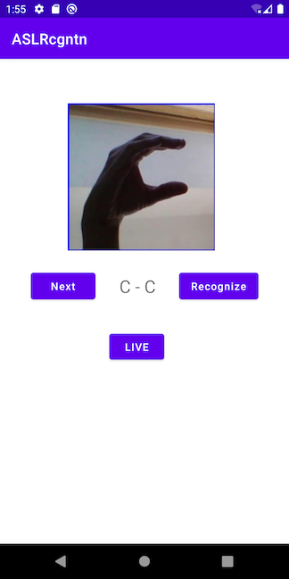
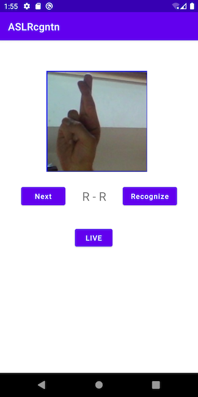

# American Sign Language Recognition on Android

## Introduction

[American Sign Language](https://en.wikipedia.org/wiki/American_Sign_Language) (ASL) is a natural language used by deaf communities in many countries around the world. It has 26 signs corresponding to the 26 letters of the English language. This repo shows Python scripts that train a deep learning model to recognize the 26 ASL signs (and 3 additional signs for deletion, space, and nothing) and converts and optimizes the model to the Mobile Interpreter format, and an Android app that uses the model to recognize the 26 ASL signs.

## Prerequisites

* PyTorch 1.10.0 and torchvision 0.11.1 (Optional)
* Python 3.8 or above (Optional)
* Android Pytorch library pytorch_android_lite:1.10.0, pytorch_android_torchvision_lite:1.10.0
* Android Studio 4.0.1 or later

## Quick Start

To Test Run the ASL recognition Android App, follow the steps below:

### 1. Train and Prepare the Model

If you don't have the PyTorch 1.10.0 and torchvision 0.11.1 installed, or if don't want to install them, you can skip this step. The trained, scripted and optimized model is already included in the repo, located at `ASLRecognitionapp/src/main/assets`.

Otherwise, open a terminal window, make sure you have torch 1.10.0 and torchvision 0.11.1 installed using command like `pip list|grep torch`, or install them using command like `pip install torch torchvision`, then run the following commands:

```
git clone https://github.com/pytorch/android-demo-app
cd android-demo-app/ASLRecognition/scripts
```

Download the ASL alphabet dataset [here](https://www.kaggle.com/grassknoted/asl-alphabet) and unzip it into the `ASLRecognition/scripts` folder. Then run the scripts below, which are based on this [tutorial](https://debuggercafe.com/american-sign-language-detection-using-deep-learning/), to pre-process the training images, train the model and convert and optimize the trained model to the mobile interpreter model:

```
pip install opencv-python pandas sklearn imutils matplotlib
python preprocess_image.py
python create_csv.py
python train.py --epochs 5 # on a machine without GPU this can take hours
python convert_lite.py
```

If all goes well, the model `asl.ptl` will be generated and you can copy it to `ASLRecognition/app/src/main/assets`.

You can also run `python test.py` to see the result of a test image located at `../app/src/main/assets/C1.jpg`:

```
Predicted output: C
0.043 seconds
```

For more information on how to use a test script like the above to find out the expected model input and output and use them in an Android app, see Step 2 of the tutorial [Image Segmentation DeepLabV3 on Android](https://pytorch.org/tutorials/beginner/deeplabv3_on_android.html#get-example-input-and-output-of-the-model-in-python).

### 2. Use Android Studio

Open the ASLRecognition project using Android Studio. Note the app's `build.gradle` file has the following lines:

```
implementation 'org.pytorch:pytorch_android_lite:1.10.0'
implementation 'org.pytorch:pytorch_android_torchvision_lite:1.10.0'
```

and in the MainActivity.java, the code below is used to load the model:

```
mModule = LiteModuleLoader.load(MainActivity.assetFilePath(getApplicationContext(), "asl.ptl"));
```

### 3. Run the App
Select an Android emulator or device and build and run the app. Some of the 26 test images of the ASL alphabet and their recognition results are as follows:





To test the live ASL alphabet gesture recognition, after you get familiar with the 26 ASL signs by tapping Next and Recognize, select the LIVE button and make some ASL gesture in front of the camera. A screencast of the app running is available [here](https://drive.google.com/file/d/1NxehGHlU-RiYP_JU9qkpCEcQR2hG-vyv/view?usp=sharing).

### 4. What's Next
With a different sign language dataset such as the RWTH-PHOENIX-Weather 2014 MS [Public Hand Shape Dataset](https://www-i6.informatik.rwth-aachen.de/~koller/1miohands-data/) or the [Continuous Sign Language Recognition Dataset](https://www-i6.informatik.rwth-aachen.de/~koller/RWTH-PHOENIX/) and a state-of-the-art [sign language transformer](https://arxiv.org/pdf/2003.13830v1.pdf) based model, more powerful sign language recognition Android app can be developed based on the app here.
