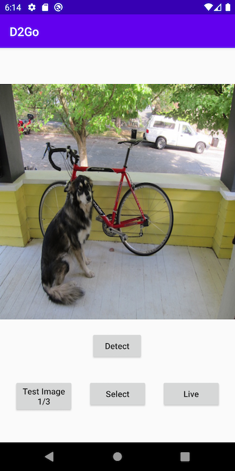
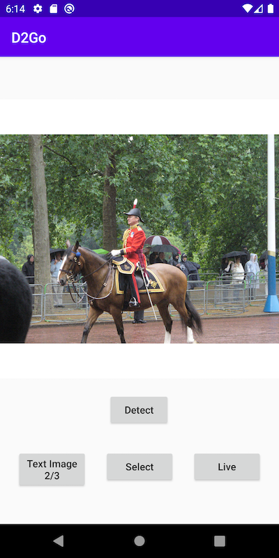
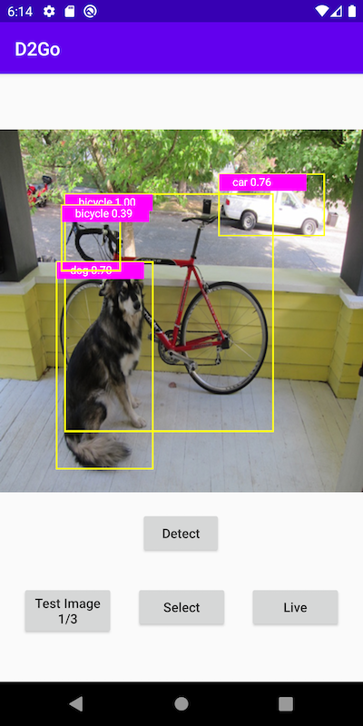
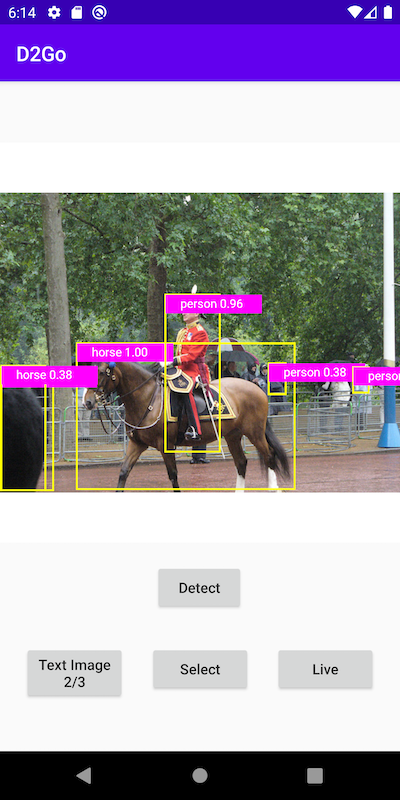

# D2Go on Android Using Native torchvision Ops Library

## Introduction

[Detectron2](https://github.com/facebookresearch/detectron2) is one of the most widely adopted open source projects and implements state-of-the-art object detection, semantic segmentation, panoptic segmentation, and human pose prediction. [D2Go](https://github.com/facebookresearch/d2go) is powered by PyTorch 1.8, torchvision 0.9, and Detectron2 with built-in SOTA networks for mobile - the D2Go model is very small (only 2.7MB) and runs very fast on Android (~50ms per inference on Pixel 3, also due to the use of the native torchvision-ops library).

This D2Go Android demo app shows how to prepare and use the D2Go model on Android. The code is based on a previous PyTorch Android [Object Detection demo app](https://github.com/pytorch/android-demo-app/tree/master/ObjectDetection) that uses a pre-trained YOLOv5 model, with modified pre-processing and post-processing code required by the D2Go model.

## Prerequisites

* PyTorch 1.10.0 and torchvision 0.11.1 (Optional)
* Python 3.8 or above (Optional)
* Android Pytorch library pytorch_android_lite 1.10.0, pytorch_android_torchvision_lite 1.10.0, torchvision_ops library 0.10.0
* Android Studio 4.0.1 or later

## Quick Start

This section shows how to create and use the D2Go model and the pre-built torchvision-ops library in a completed Android app. To just build and run the app without creating the D2Go model yourself, go directly to Step 4.

1. Install PyTorch 1.10.0 and torchvision 0.11.1, for example:

```
conda create -n d2go python=3.8.5
conda activate d2go
pip install torch torchvision
```

2. Install Detectron2, mobile_cv, and D2Go

```
python -m pip install 'git+https://github.com/facebookresearch/detectron2.git'
python -m pip install 'git+https://github.com/facebookresearch/mobile-vision.git'
git clone https://github.com/facebookresearch/d2go
cd d2go & python -m pip install .

```

3. Create the D2Go model

```
git clone https://github.com/pytorch/android-demo-app
cd android-demo-app/D2Go
python create_d2go.py
```
This will create the quantized D2Go model and save it at `android-demo-app/D2Go/ObjectDetection/app/src/main/assets/d2go.pt`.  

The size of the quantized D2Go model is only 2.6MB.

4. Build and run the D2Go Android app

If you have not gone through Step 3, simply run `git clone https://github.com/pytorch/android-demo-app` first.

In Android Studio, open `android-demo-app/D2Go` (not `android-demo-app/D2Go/ObjectDetection`). If an error "Gradle’s dependency may be corrupt" occurs, go to Android Studio - File - Project Structure... , change Gradle Version to 4.10.1.

The main changes needed to use the D2Go model and the required and pre-built torchvision-ops library are adding
```
implementation 'org.pytorch:pytorch_android_lite:1.10.0'
implementation 'org.pytorch:pytorch_android_torchvision_lite:1.10.0'
implementation 'org.pytorch:torchvision_ops:0.10.0'
```
in the build.gradle file and
```
static {
    if (!NativeLoader.isInitialized()) {
        NativeLoader.init(new SystemDelegate());
    }
    NativeLoader.loadLibrary("pytorch_jni");
    NativeLoader.loadLibrary("torchvision_ops");
}
```
in the MainActivity.java.

Select an Android emulator or device to run the app. You can go through the included example test images to see the detection results. You can also select a picture from your Android device's Photos library, take a picture with the device camera, or even use live camera to do object detection - see this [video](https://drive.google.com/file/d/18-2hLc-7JAKtd1q00X-5pHQCAdyJg7dZ/view?usp=sharing) for a screencast of the app running.

One quick note about the model performance. In the `MainActivity.java`, the following code snippet shows how fast the D2Go model runs:

```
final long startTime = SystemClock.elapsedRealtime();
IValue[] outputTuple = mModule.forward(IValue.listFrom(inputTensor)).toTuple();
final long inferenceTime = SystemClock.elapsedRealtime() - startTime;
Log.d("D2Go",  "inference time (ms): " + inferenceTime);
```

On a Pixel 3 phone, it takes about 50ms to infer an image, compared with the 550ms taken by the YOLOv5 model in the [Object Detection demo app](https://github.com/pytorch/android-demo-app/tree/master/ObjectDetection).

Some example images and the detection results are as follows:






