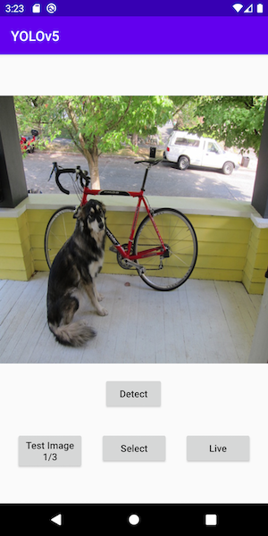
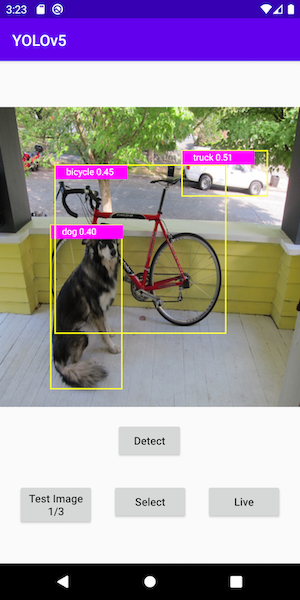
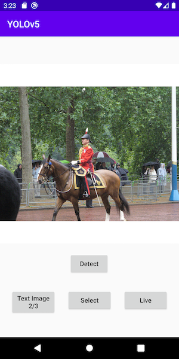
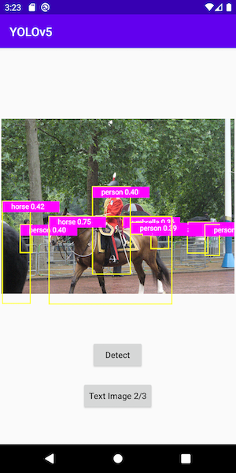

# Object Detection with YOLOv5 on Android

## Introduction

[YOLO](https://pjreddie.com/darknet/yolo/) (You Only Look Once) is one of the fastest and most popular object detection models. [YOLOv5](https://github.com/ultralytics/yolov5) is an open-source implementation of the latest version of YOLO (for a quick test of loading YOLOv5 from PyTorch hub for inference, see [here](https://pytorch.org/hub/ultralytics_yolov5/#load-from-pytorch-hub)). This Object Detection with YOLOv5 Android sample app uses the PyTorch scripted YOLOv5 model to detect objects of the [80 classes](https://github.com/ultralytics/yolov5/blob/master/data/coco.yaml) trained with the model.

## Prerequisites

* PyTorch 1.9.0 or later (Optional)
* Python 3.8 (Optional)
* Android Pytorch library pytorch_android_lite:1.9.0 and pytorch_android_torchvision:1.9.0
* Android Studio 4.0.1 or later

## Quick Start

To Test Run the Object Detection Android App, follow the steps below:

### 1. Prepare the Model

If you don't have the PyTorch environment set up to run the script, you can download the model file `yolov5s.torchscript.ptl` [here](https://drive.google.com/u/1/uc?id=1_MF7NVi9Csm1lizoSCp1wCtUUUpuhwet&export=download) to the `android-demo-app/ObjectDetection/app/src/main/assets` folder, then skip the rest of this step and go to step 2 directly.

Be aware that the downloadable model file was created with PyTorch 1.9.0, matching the PyTorch Android library 1.9.0 specified in the project's `build.gradle` file as `implementation 'org.pytorch:pytorch_android_lite:1.9.0'`. If you use a different version of PyTorch to create your model by following the instructions below, make sure you specify the same PyTorch Android library version in the `build.gradle` file to avoid possible errors caused by the version mismatch. Furthermore, if you want to use the latest PyTorch master code to create the model, follow the steps at [Building PyTorch Android from Source](https://pytorch.org/mobile/android/#building-pytorch-android-from-source) and [Using the PyTorch Android Libraries Built](https://pytorch.org/mobile/android/#using-the-pytorch-android-libraries-built-from-source-or-nightly) on how to use the model in Android.

The Python script `export.py` in the `models` folder of the [YOLOv5 repo](https://github.com/ultralytics/yolov5) is used to generate a TorchScript-formatted YOLOv5 model named `yolov5s.torchscript.pt` for mobile apps.

Open a Mac/Linux/Windows Terminal, run the following commands (note that we use the fork of the original YOLOv5 repo to make sure the code changes work, but feel free to use the original repo):

```
git clone https://github.com/jeffxtang/yolov5
cd yolov5
pip install -r requirements.txt
```

Then edit `models/export.py` to make the following four changes:

* Change line 50 from `model.model[-1].export = True` to `model.model[-1].export = False`

* Change line 56 from `f = opt.weights.replace('.pt', '.torchscript.pt')` to `f = opt.weights.replace('.pt', '.torchscript.ptl')`

* Add the following two lines of model optimization code after line 57, between `ts = torch.jit.trace(model, img)` and `ts.save(f)`:

```
    from torch.utils.mobile_optimizer import optimize_for_mobile
    ts = optimize_for_mobile(ts)    
```

* Replace the line `ts.save(f)` with `ts._save_for_lite_interpreter(f)`.

If you ignore this step, you can still create a TorchScript model for mobile apps to use, but the inference on a non-optimized model can take twice as long as the inference on an optimized model - using the Android app test images, the average inference time on an optimized and non-optimized model is 0.6 seconds and 1.18 seconds, respectively. See [SCRIPT AND OPTIMIZE FOR MOBILE RECIPE](https://pytorch.org/tutorials/recipes/script_optimized.html) for more details.

Now run the script below to generate the optimized TorchScript model and copy the generated model file `yolov5s.torchscript.ptl` to the `android-demo-app/ObjectDetection/app/src/main/assets` folder:

```
python models/export.py
```

Note that small sized version of the YOLOv5 model, which runs faster but with less accuracy, is generated by default when running the `export.py`. You can also change the value of the `weights` parameter in the `export.py` to generate the medium, large, and extra large version of the model.

### 2. Build with Android Studio

Start Android Studio, then open the project located in `android-demo-app/ObjectDetection`

### 3. Run the app

Select an Android emulator or device to run the app. You can go through the included example test images to see the detection results. You can also select a picture from your Android device's Photos library, take a picture with the device camera, or even use live camera to do object detection - see this [video](https://drive.google.com/file/d/1-5AoRONUqZPZByM-fy0m7r8Ct11OnlIT/view) for a screencast of the app running.

Some example images and the detection results are as follows:






