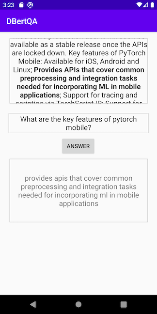
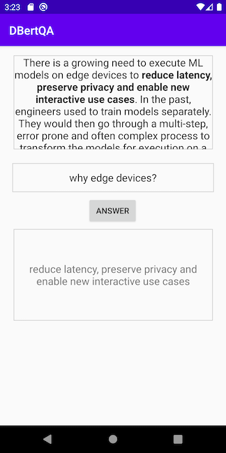
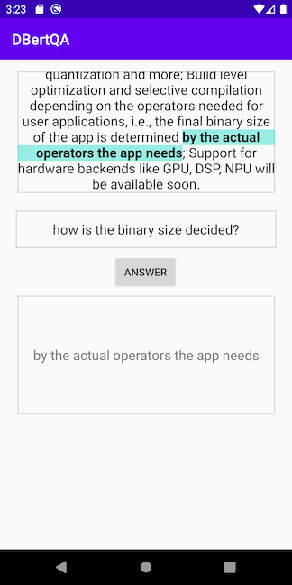

# Question Answering on Android with Kotlin

## Introduction

Question Answering (QA) is one of the common and challenging Natural Language Processing tasks. With the revolutionary transformed-based [BERT](https://arxiv.org/abs/1810.04805) model coming out in October 2018, question answering models have reached their state of art accuracy by fine-tuning BERT-like models on QA datasets such as [Squad](https://rajpurkar.github.io/SQuAD-explorer). [Huggingface](https://huggingface.co)'s [DistilBERT](https://huggingface.co/transformers/model_doc/distilbert.html) is a smaller and faster version of BERT - DistilBERT "has 40% less parameters than bert-base-uncased, runs 60% faster while preserving over 95% of BERT’s performances as measured on the GLUE language understanding benchmark."

In this demo app, written in Kotlin, we'll show how to quantize and convert the Huggingface's DistilBert QA model to TorchScript and how to use the scripted model on an Android demo app to perform question answering.

## Prerequisites

* PyTorch 1.10.0 or later (Optional)
* Python 3.8 (Optional)
* Android Pytorch library org.pytorch:pytorch_android_lite:1.10.0
* Android Studio 4.0.1 or later

## Quick Start

To Test Run the Android QA App, follow the steps below:

### 1. Prepare the Model

If you don't have PyTorch installed or want to have a quick try of the demo app, you can download the scripted QA model `qa360_quantized.ptl` [here](https://pytorch-mobile-demo-apps.s3.us-east-2.amazonaws.com/qa360_quantized.ptl) and save it to the `QuestionAnswering/app/src/main/assets` folder, then continue to Step 2.

With PyTorch 1.10.0 installed, first install the Huggingface `transformers` by running `pip install transformers`, then run `python convert_distilbert_qa.py`.

Note that a pre-defined question and text, resulting in the size of the input tokens (of question and text) being 360, is used in the `convert_distilbert_qa.py`, and 360 is the maximum token size for the user text and question in the app. If the token size of the inputs of the text and question is less than 360, padding will be needed to make the model work correctly.

After the script completes, copy the model file `qa360_quantized.ptl` to the Android app's assets folder.

### 2. Build and run with Android Studio

Start Android Studio, open the project located in `android-demo-app/QuestionAnswering`, and run on your AVD or real Android device. See this [video](https://drive.google.com/file/d/10hwGNFo5tylalKwut_CWFPJmV7JRdDKF/view?usp=sharing) for a screencast of the app running. Some example translation results are:

