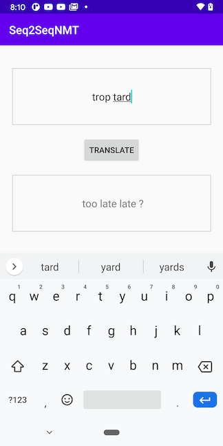
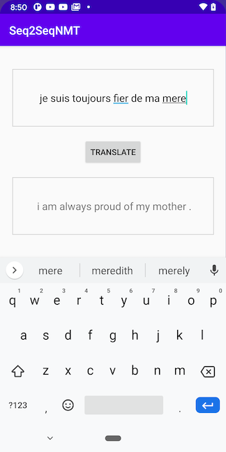
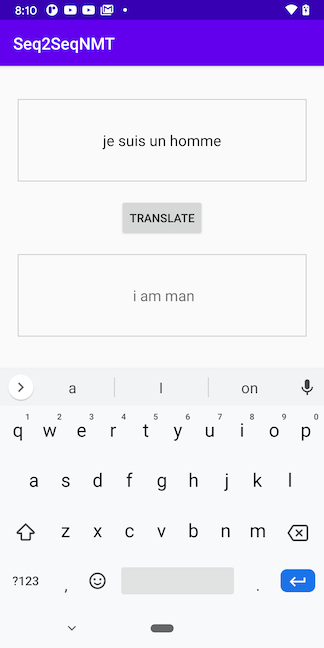

# Neural Machine Translation on Android

## Introduction

The PyTorch tutorial [NLP FROM SCRATCH: TRANSLATION WITH A SEQUENCE TO SEQUENCE NETWORK AND ATTENTION](https://pytorch.org/tutorials/intermediate/seq2seq_translation_tutorial.html) is an easy-to-follow tutorial that has step-by-step instructions on how to train sequence to sequence encoder and decode networks with an attention mechanism for neural machine translation. Although the quality of the translation between English and French using the model in the tutorial may not be as good as a leading-edge transformer based model, it presents a great example of how to deploy an interesting model trained from scratch in an Android app.

This Android demo app shows:

* The Python code that saves the encoder and attention-enhanced decoder models, trained based on the code in the PyTorch NMT tutorial;
* The Python code that loads the saved encoder and decoder models, optimizes them and saves again for mobile apps to use;
* The Android app that uses the encoder and decoder models to do French-English translation.

## Prerequisites

* PyTorch 1.10.0 (Optional)
* Python 3.8 (Optional)
* Android Pytorch library org.pytorch:pytorch_android_lite:1.10.0
* Android Studio 4.0.1 or later

## Quick Start

To Test Run the Object Detection Android App, follow the steps below:

### 1. Prepare the Model

If you don't have the PyTorch environment set up to run the script, you can download the PyTorch trained and optimized NMT encoder and decoder models compressed in a zip [here](https://drive.google.com/file/d/1S75cWNEp43U6nCp2MOBR-jE-ZnlHz1PI/view?usp=sharing), unzip it, copy them to the Android app's assets folder, and skip the rest of this step and go to step 2 directly.

If you have a good GPU and want to train your model from scratch, run `python seq2seq_nmt.py` to go through the whole process of training, saving, loading, optimizing and saving the final mobile-ready models `optimized_encoder_150k.ptl` and `optimized_decoder_150k.ptl`. Copy the two model files to the Android app's assets folder.

### 2. Build and run with Android Studio

Start Android Studio, open the project located in `android-demo-app/Seq2SeqNMT`, and run on your AVD or real Android device. See this [video](https://drive.google.com/file/d/110KN3Pa9DprkBWnzj8Ppa8KMymhmBI61/view?usp=sharing) for a screencast of the app running. Some example translation results are:

