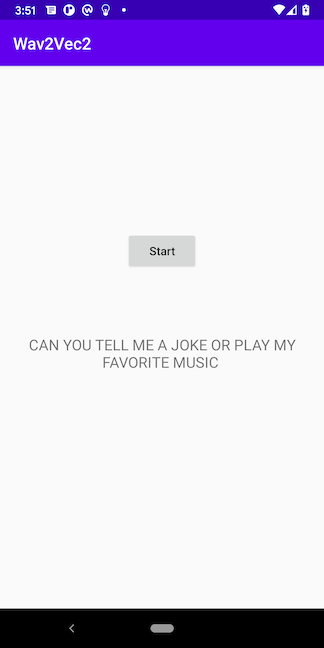
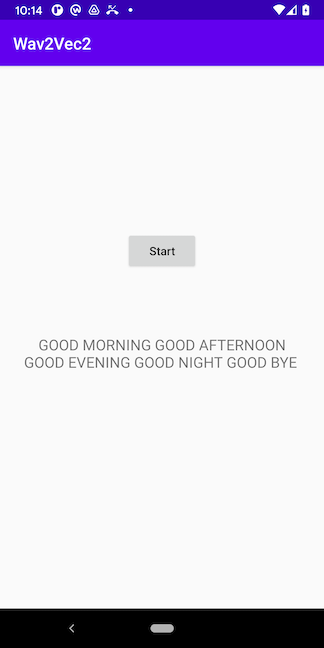

# Speech Recognition on Android with Wav2Vec2

## Introduction

Facebook AI's [wav2vec 2.0](https://github.com/pytorch/fairseq/tree/master/examples/wav2vec) is one of the leading models in speech recognition. It is also available in the [Huggingface Transformers](https://github.com/huggingface/transformers) library, which is also used in another PyTorch Android demo app for [Question Answering](https://github.com/pytorch/android-demo-app/tree/master/QuestionAnswering).

In this demo app, we'll show how to quantize and convert the wav2vec2 model to TorchScript and how to use the scripted model on an Android demo app to perform speech recognition.

## Prerequisites

* PyTorch 1.8 (Optional)
* Python 3.8 (Optional)
* Android Pytorch library 1.8
* Android Studio 4.0.1 or later

## Quick Start

To Test Run the Android speech recognition App, run the following commands on a Terminal:

### 1. Prepare the Model

If you don't have PyTorch installed or want to have a quick try of the demo app, you can download the quantized scripted wav2vec2 model compressed in a zip file [here](https://drive.google.com/file/d/1wW6qs-OR76usbBXvEyqUH_mRqa0ShMfT/view?usp=sharing), then unzip it to the assets folder, and continue to Step 2.

Be aware that the downloadable model file was created with PyTorch 1.8.0, matching the PyTorch Android library 1.8.0 specified in the project's `build.gradle` file as `implementation 'org.pytorch:pytorch_android:1.8.0'`. If you use a different version of PyTorch to create your model by following the instructions below, make sure you specify the same PyTorch Android library version in the `build.gradle` file to avoid possible errors caused by the version mismatch. Furthermore, if you want to use the latest PyTorch master code to create the model, follow the steps at [Building PyTorch Android from Source](https://pytorch.org/mobile/android/#building-pytorch-android-from-source) and [Using the PyTorch Android Libraries Built](https://pytorch.org/mobile/android/#using-the-pytorch-android-libraries-built-from-source-or-nightly) on how to use the model in Android.

With PyTorch 1.8 installed, first install the Huggingface `transformers` by running `pip install transformers` (the version that has been tested is 4.3.2), then run `python create_wav2vec2.py`, which creates `wav2vec_traced_quantized.pt` in the `app/src/main/assets` folder.

Note that the sample scent_of_a_woman_future.wav file used to trace the model is about 6 second long, so 6 second is the limit of the recorded audio for speech recognition in the demo app. If your speech is less than 6 seconds, padding is applied in the code to make the model work correctly.

[Dynamic quantization](https://pytorch.org/tutorials/intermediate/dynamic_quantization_bert_tutorial.html) is used to quantize the model to reduce its size.

### 2. Build and run with Android Studio

Start Android Studio, open the project located in `android-demo-app/SpeechRecognition`, and run on an Android device: tap the Start button and start saying something; after 6 seconds, the model will infer to recognize your speech. Only basic decoding of the recognition result from an array of floating numbers to a list of tokens is provided in this demo app, but it is easy to see, without further post-processing, whether the model can recognize your utterances. Some example recognition results are:

