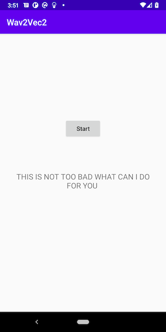

# Speech Recognition on Android with Wav2Vec2

## Introduction

Facebook AI's [wav2vec 2.0](https://github.com/pytorch/fairseq/tree/master/examples/wav2vec) is one of the leading models in speech recognition. It is also available in the [Huggingface Transformers](https://github.com/huggingface/transformers) library, which is also used in another PyTorch Android demo app for [Question Answering](https://github.com/pytorch/android-demo-app/tree/master/QuestionAnswering).

In this demo app, we'll show how to quantize, trace, and optimize the wav2vec2 model, powered by the newly released torchaudio 0.9.0, and how to use the converted model on an Android demo app to perform speech recognition.

## Prerequisites

* PyTorch 1.9.0 and torchaudio 0.9.0 (Optional)
* Python 3.8 (Optional)
* Android PyTorch library 1.9.0
* Android Studio 4.0.1 or later

## Quick Start

### 1. Get the Repo

Simply run the commands below:

```
git clone https://github.com/pytorch/android-demo-app
cd android-demo-app/SpeechRecognition
```

If you don't have PyTorch 1.9.0 and torchaudio 0.9.0 installed or want to have a quick try of the demo app, you can download the quantized scripted wav2vec2 model file [here](https://drive.google.com/file/d/1RcCy3K3gDVN2Nun5IIdDbpIDbrKD-XVw/view?usp=sharing), then drag and drop it to the `app/src/main/assets` folder inside  `android-demo-app/SpeechRecognition`, and continue to Step 3.

### 2. Prepare the Model

To install PyTorch 1.9.0, torchaudio 0.9.0 and the Hugging Face transformers, you can do something like this:

```
conda create -n wav2vec2 python=3.8.5
conda activate wav2vec2
pip install torch torchaudio
pip install transformers
```

Now with PyTorch 1.9.0 and torchaudio 0.9.0 installed, run the following commands on a Terminal:

```
python create_wav2vec2.py
```
This will create the model file `wav2vec2.pt`. Copy it to the Android app:
```

mkdir -p app/src/main/assets
cp wav2vec2.pt app/src/main/assets
```

### 2. Build and run with Android Studio

Start Android Studio, open the project located in `android-demo-app/SpeechRecognition`, build and run the app on an Android device. After the app runs, tap the Start button and start saying something; after 12 seconds (you can change `private final static int AUDIO_LEN_IN_SECOND = 12;` in `MainActivity.java` for a shorter or longer recording length), the model will infer to recognize your speech. Some example recognition results are:




