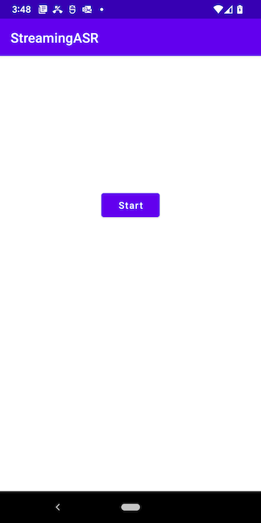
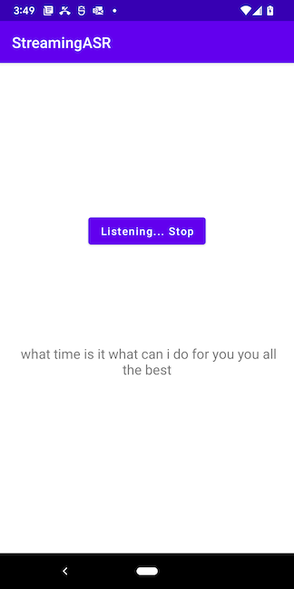

# Streaming Speech Recognition on Android with Emformer-RNNT-based Model

## Introduction

In the Speech Recognition Android [demo app](https://github.com/pytorch/android-demo-app/tree/master/SpeechRecognition), we showed how to use the [wav2vec 2.0](https://github.com/pytorch/fairseq/tree/master/examples/wav2vec) model on an Android demo app to perform non-continuous speech recognition. Here we're going one step further, using a torchaudio [Emformer-RNNT-based ASR](https://pytorch.org/audio/main/prototype.pipelines.html#torchaudio.prototype.pipelines.EMFORMER_RNNT_BASE_LIBRISPEECH) model in Android to perform streaming speech recognition.

## Prerequisites

* PyTorch 1.12 and torchaudio 0.12 or above (Optional)
* Python 3.8 (Optional)
* Android Pytorch library org.pytorch:pytorch_android_lite:1.12.2
* Android Studio 4.0.1 or later

## Quick Start

### 1. Get the Repo

Simply run the commands below:

```
git clone https://github.com/pytorch/android-demo-app
cd android-demo-app/StreamingASR
```

If you don't have PyTorch 1.12 and torchaudio 0.12 installed or want to have a quick try of the demo app, you can download the optimized scripted model file [streaming_asrv2.ptl](https://drive.google.com/file/d/1XRCAFpMqOSz5e7VP0mhiACMGCCcYfpk-/view?usp=sharing), then drag and drop it to the `StreamingASR/app/src/main/assets` folder inside `android-demo-app/StreamingASR`, and continue to Step 3.

### 2. Test and Prepare the Model

To install PyTorch 1.12, torchaudio 0.12, and other required packages (numpy, pyaudio, and fairseq), do something like this:

```
conda create -n pt1.12 python=3.8.5
conda activate pt1.12
pip install torch torchaudio numpy pyaudio fairseq
```

First, create the model file `scripted_wrapper_tuple.pt` by running `python generate_ts.py`.

Then, to test the model, run `python run_sasr.py`. After you see:
```
Initializing model...
Initialization complete.
```
say something like "good afternoon happy new year", and you'll likely see the streaming recognition results `good afternoon happy new year` while you speak. Hit Ctrl-C to end.

Finally, to optimize and convert the model to the format that can run on Android, run the following commands:
```
mkdir -p StreamingASR/app/src/main/assets
python save_model_for_mobile.py
mv streaming_asrv2.ptl StreamingASR/app/src/main/assets
```

### 3. Build and run with Android Studio

Start Android Studio, open the project located in `android-demo-app/StreamingASR/StreamingASR`, build and run the app on an Android device (not an emulator). After the app runs, tap the Start button and start saying something. Some example recognition results are:





## Librosa C++, Eigen, and JNI

The first version of this demo uses a [C++ port](https://github.com/ewan-xu/LibrosaCpp/) of [Librosa](https://librosa.org), a popular audio processing library in Python, to perform the MelSpectrogram transform, because torchaudio before version 0.11 doesn't support fft on Android (see [here](https://github.com/pytorch/audio/issues/408)). Using the Librosa C++ port and [JNI](https://developer.android.com/training/articles/perf-jni) (Java Native Interface) on Android makes the MelSpectrogram possible on Android. Furthermore, the Librosa C++ port requires [Eigen](https://eigen.tuxfamily.org/), a C++ template library for linear algebra, so both the port and the Eigen library are included in the first version of the demo app and built as JNI.

See [here](https://github.com/jeffxtang/android-demo-app/tree/librosa_jni/StreamingASR) for the first version of the demo if interested in an example of using native C++ to expand operations not yet supported in PyTorch or one of its domain libraries.
