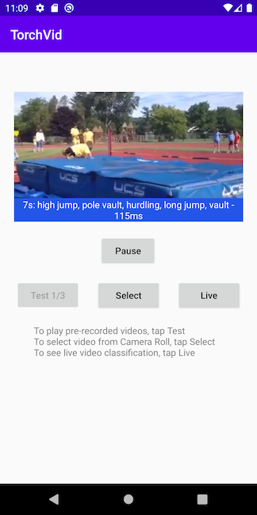
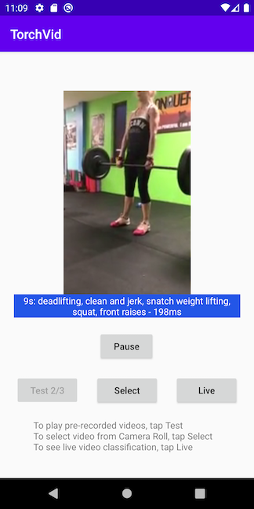
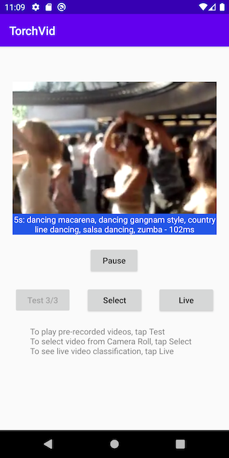

# PyTorch Video Classification on Android

## Introduction

The newly released open-sourced [PyTorchVideo](https://github.com/facebookresearch/pytorchvideo) adds video understanding to the rapidly growing PyTorch ecosystem. This PyTorchVideo Classification on iOS demo app shows how to use a pre-trained PyTorchVideo classification model on iOS to see video classification results, updated per second while the video plays, on tested videos, videos from the Photos library, or even real-time videos.

## Prerequisites

* PyTorch 1.10.0, torchvision 0.11.0, PyTorchVideo 0.1.3 (Optional)
* Python 3.8 or above (Optional)
* Android library org.pytorch:pytorch_android_lite:1.10.0, org.pytorch:pytorch_android_torchvision_lite:1.10.0
* Android Studio 4.0.1 or later

## Quick Start

### 1. Prepare the Model (Optional)

If you don't have the PyTorch environment set up to run the script, you can download the model file `video_classification.ptl` [here](https://drive.google.com/file/d/1ti8Eb59L5BZV3YJa-c0AUx6XCgEvsqlV/view?usp=sharing) to the `android-demo-app/TorchVideo/app/src/main/assets` folder, then skip the rest of this step and go to step 2 directly.

To create the model yourself, simply run the following commands:
```
conda create -n pt1.10 python=3.8.5
conda activate pt1.10
pip install torch torchvision
pip install pytorchvideo

# pip list|grep torch
# torch             1.10.0
# torchvision       0.11.1
# pytorchvideo      0.1.3

cd android-demo-app/TorchVideo
python build_model.py

```
The model file `video_classification.ptl` will be created and saved in the `app/src/main/assets` folder.

### 2. Build with Android Studio

Start Android Studio, then open the project located in `android-demo-app/TorchVideo`. Note the app's `build.gradle` file has the following lines:

```
implementation 'org.pytorch:pytorch_android_lite:1.10.0'
implementation 'org.pytorch:pytorch_android_torchvision_lite:1.10.0'
```

### 3. Run the app

Select an Android emulator or, to test videos from your Camera Roll or live video, select an Android device to run the app. You can go through the included pre-recorded test videos to see the classification results per second. You can also select a video from your Android device's Camera Roll, or use camera to do live video classification - see this [video](https://drive.google.com/file/d/16gdgQvzOMDS63CODaZO8qsEeUO5iWLAx/view?usp=sharing) for a screencast of the app running.

Some screenshots of the video classification results are as follows:




