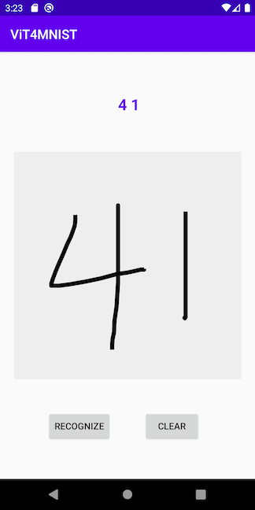
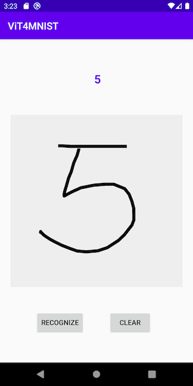
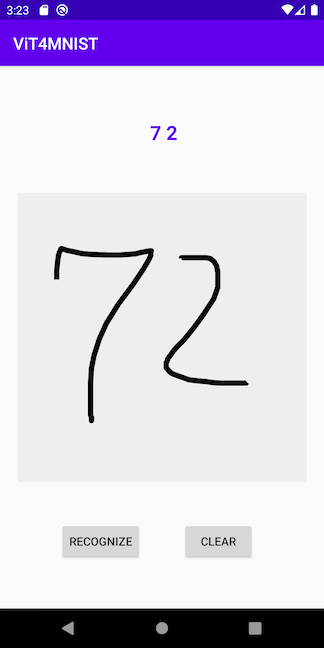

# Vision Transformer with ImageNet and MNIST on Android

## Introduction

[ImageNet](http://image-net.org) is the most popular image dataset on which the breakthrough of deep learning took place in 2012, the handwritten digit dataset [MNIST](https://en.wikipedia.org/wiki/MNIST_database) is the oldest and most commonly used dataset for machine learning, and the Vision Transformer (ViT - [blog](https://ai.googleblog.com/2020/12/transformers-for-image-recognition-at.html) and [paper](https://arxiv.org/abs/2010.11929)) is one of the most recent models in deep learning, applying the revolutionary [transformer](ttps://arxiv.org/abs/1810.04805) model that was first successfully applied in natural language processing to computer vision.

In this demo app, we'll integrate the two oldest and most popular image datasets with the latest deep learning model and show you:

1. How to use the [Facebook DeiT](https://github.com/facebookresearch/deit) model, a ViT model pre-trained on ImageNet, for image classification on Android;

2. How to train another [ViT model on MNIST](https://towardsdatascience.com/a-demonstration-of-using-vision-transformers-in-pytorch-mnist-handwritten-digit-recognition-407eafbc15b0) and convert it to TorchScript to use on Android for handwritten digit recognition.

## Prerequisites

* PyTorch 1.10 or later (Optional)
* Python 3.8 (Optional)
* Android Pytorch library 1.10 or later
* Android Studio 4.0.1 or later

## Quick Start on Using Facebook DeiT

### 1. Prepare the Model (Optional)

To use a pre-trained Facebook DeiT model and convert it to TorchScript, first install [PyTorch](https://pytorch.org/get-started/locally/) 1.10 or later, then install [timm](https://github.com/rwightman/pytorch-image-models) using `pip install timm==0.3.2`, and finally run the following script:

```
python convert_deit.py
```

This will generate the quantized scripted model named `fbdeit.pt`, which can also be downloaded [here](https://drive.google.com/file/d/1CN5BCYPh78uT2GCEobcOMtk5HSX3qe1x/view?usp=sharing). Note that the quantization code in the script reduces the model size from 346MB to 89MB.

To train and convert your own DeiT model on ImageNet, first follow the instructions under Data Preparation and Training at the [DeiT repo](https://github.com/facebookresearch/deit), then simply run the following code after `model` is trained:
```
from torch.utils.mobile_optimizer import optimize_for_mobile
ts_model = torch.jit.script(model)
optimized_torchscript_model = optimize_for_mobile(ts_model)
optimized_torchscript_model.save("fbdeit.pt")
```

### 2. Run the Model on Android

The official [PyTorch Android HelloWorld](https://github.com/pytorch/android-demo-app#the-helloworld-example) example app uses Resnet18 for image classification. To run the converted `fbdeit.pt` on Android, first follow the steps in the HelloWorld example to make sure it works (the `org.pytorch:pytorch_android:` and `org.pytorch:pytorch_android_torchvision:` in [gradle file](https://github.com/pytorch/android-demo-app/blob/master/HelloWorldApp/app/build.gradle) need to be 1.7.0, to be consistent with the PyTorch version used to generate the model file).

Then, drag and drop the `fdbeit.pt` model generated or downloaded in Step 1 to the HelloWorld project's asset folder.

Finally, change the line of code in the project's [MainActivity.java](https://github.com/pytorch/android-demo-app/blob/master/HelloWorldApp/app/src/main/java/org/pytorch/helloworld/MainActivity.java) file from:
```
module = Module.load(assetFilePath(this, "model.pt"));
```
to
```
module = Module.load(assetFilePath(this, "fbdeit.pt"));
```

Run the app in Android Studio and you'll see the same image classification result.

## Quick Start on Using ViT for MNIST

To Test Run the Android ViT4MNIST demo app, follow the steps below:

### 1. Prepare the Model (Optional)

On a Terminal, with PyTorch 1.10.0 and [einops](https://pypi.org/project/einops/) installed (using `pip install einops`), run :
```
python mnist_vit.py
```

The model definition in `vit_pytorch.py` and training code in `mnist_vit.py` are mostly taken from the blog [here](https://towardsdatascience.com/a-demonstration-of-using-vision-transformers-in-pytorch-mnist-handwritten-digit-recognition-407eafbc15b0). After the training, which takes about 20 minutes on a MacBook Pro, the model is saved as `vit4mnist.pt` and then dynamic-quantized, converted to TorchScript, optimized, and saved as `vit4mnist.pth`, which should be the same as the one already added in the app project, located at `app/src/main/assets`.

### 2. Build and run with Android Studio

Start Android Studio, open the project located in `android-demo-app/ViT4MNIST`, and run on your AVD or real Android device. See this [video](https://drive.google.com/file/d/11L5mIjrLn7B7VdwjQl5vJv3ZVK4hcYut/view?usp=sharing) for a screencast of the app running. Some example translation results are:




